# Top Comment

[My Notes](notes.md)

Top Comment is a fast-paced, real-time mmultiplayer party game inspired by the chaotic and hilarious world of comment sections on Instagram's Reels feature. Players complete to find the most "liked" gif for a specific prompt simulating the experience of trying to land the top comment on a viral post.

> [!NOTE]
> This is a template for your startup application. You must modify this `README.md` file for each phase of your development. You only need to fill in the section for each deliverable when that deliverable is submitted in Canvas. Without completing the section for a deliverable, the TA will not know what to look for when grading your submission. Feel free to add additional information to each deliverable description, but make sure you at least have the list of rubric items and a description of what you did for each item.

> [!NOTE]
> If you are not familiar with Markdown then you should review the [documentation](https://docs.github.com/en/get-started/writing-on-github/getting-started-with-writing-and-formatting-on-github/basic-writing-and-formatting-syntax) before continuing.

## 🚀 Specification Deliverable

> [!NOTE]
> Fill in this sections as the submission artifact for this deliverable. You can refer to this [example](https://github.com/webprogramming260/startup-example/blob/main/README.md) for inspiration.

For this deliverable I did the following. I checked the box `[x]` and added a description for things I completed.

- [x] Proper use of Markdown
- [x] A concise and compelling elevator pitch
- [x] Description of key features
- [x] Description of how you will use each technology
- [x] One or more rough sketches of your application. Images must be embedded in this file using Markdown image references.

### Elevator pitch

Have you ever seen a reel on Instagram, opened the comment section, and laughed even harder at the gif someone replied with? Top Comment turns that social media intuition for the chronically onlne into a competitive game. Players are given a situational prompt, like "Your reaction when the Smarty building off I-15 rick rolls you" and tasked with finding the ultimate visual comeback. It's a real-time race to see who can read the room, win the most 'likes' from their friends, and climb the global leaderboard to become the internet's ultimate tastemaker.

### Design

Here's a diagram that reflects how people would interact with the central server to play the game. This diagram is a four player scenario.

```mermaid
sequenceDiagram
    actor Player1
    participant Server
    actor Player2
    actor Player3
    actor Player4
    Player1->>Server: Create Room
    Player2->>Server: Join Room
    Player3->>Server: Join Room
    Player4->>Server: Join Room
    Server->>Player1: New Prompt: "Monday Morning"
    Server->>Player2: New Prompt: "Monday Morning"
    Server->>Player3: New Prompt: "Monday Morning"
    Server->>Player4: New Prompt: "Monday Morning"
    Player1->>Server: Submit GIF
    Player2->>Server: Submit GIF
    Player3->>Server: Submit GIF
    Player4->>Server: Submit GIF
    Server->>Player1: Voting Phase
    Server->>Player2: Voting Phase
    Server->>Player3: Voting Phase
    Server->>Player4: Voting Phase

```

### Key features

- Secure login and registration to track wins and stats alongside adding friends and sharing online status
- Create or join Threads, or rooms, to compete with friends.
- Dynamic Giphy/Tenor integration with the ability to search, select, and send GIFs using free APIs.
- Players like the Top Comment (essentially a voting phase) to determine the winner for that prompt.

### Technologies

I am going to use the required technologies in the following ways.

- **HTML** - I will use HTML5 to structure the login forms, the Thread lobbies (the game room lobby), the voting interface (meant to mimic a social media comment section) and display the GIF search results grid.
- **CSS** - I will use CSS to create a modern UI reminiscent of a social media page or app. I plan on using the CSS grid extensively to master item placement within the game.
- **React** - React will handle the state of the application such as the game room and the transition between submission and voting phases.
- **Service** - I will build and design a backend service to handle room logic, user sessions, and data storage.
- **DB/Login** - A simple MySQL or PostgreSQL db will store user credentials, room information, a user's friends, and global leaderboards.
- **WebSocket** - Websockets will be used to broadcast player submissions and votes in real-time and used as a synchronization tool to ensure the game is the same for all players.

## 🚀 AWS deliverable

For this deliverable I did the following. I checked the box `[x]` and added a description for things I completed.

- [ ] **Server deployed and accessible with custom domain name** - [My server link](https://yourdomainnamehere.click).

## 🚀 HTML deliverable

For this deliverable I did the following. I checked the box `[x]` and added a description for things I completed.

- [x] **HTML pages** - I built four main HTML pages: a home/login page, a game play page, a leaderboard/scores page, and an about page to give some context.
- [x] **Proper HTML element usage** - I used semantic tags like `<header>`, `<nav>`, `<main>`, and `<footer>` on every page to keep things organized. I also used `<section>` and `<aside>` for specific parts of the gameplay UI.
- [x] **Links** - All the pages are linked together in a navigation menu. I also included a link to my GitHub repo in the footer so people can see the code.
- [x] **Text** - I added text to explain the game's rules on the about page and included example prompts and status messages in the game room.
- [x] **3rd party API placeholder** - On the about page, I added a placeholder for a "Daily Featured GIF" from Giphy. The play page also has a search bar and some hardcoded GIFs to show where the API results will go.
- [x] **Images** - I've got a placeholder image for a game screenshot on the about page and used several GIF images on the play page to simulate the search results.
- [x] **Login placeholder** - The index page has a login form with email and password fields, plus buttons for logging in or creating a new account.
- [x] **DB data placeholder** - The scores page uses tables to show how I'll display leaderboard and friend data from the database later on. 
- [x] **WebSocket placeholder** - I added a "Live Events" sidebar on the play page that shows real-time updates like users joining or the round timer, which will eventually be powered by WebSockets.

## 🚀 CSS deliverable

For this deliverable I did the following. I checked the box `[x]` and added a description for things I completed.

- [x] **Visually appealing colors and layout. No overflowing elements.** - I implemented a dark-mode aesthetic using a custom color palette (dark grey/purple) and ensured the layout fits the viewport height without unwanted scrollbars, specifically using `overflow: hidden` on the main body and specific scroll areas for content.
- [x] **Use of a CSS framework** - I utilized Bootstrap 5 for the core layout structure (containers, rows, cols), navigation bar, and standard components like buttons and forms.
- [x] **All visual elements styled using CSS** - Every element, including the game cards, leaderboard tables, and input fields, has been styled to match the dark theme, overriding default browser styles and some Bootstrap defaults.
- [x] **Responsive to window resizing using flexbox and/or grid display** - The application uses Flexbox for the sticky footer and vertical alignment. I implemented a responsive column-count layout (Masonry style) for the GIF grid that adjusts from 1 to 4 columns based on screen width.
- [x] **Use of a imported font** - I imported the 'Lexend' font family from Google Fonts and applied it globally to the body element.
- [x] **Use of different types of selectors including element, class, ID, and pseudo selectors** - I used class selectors for components (`.game-card`), element selectors for base styles (`body`, `main`), and pseudo-selectors for interactivity (`:hover` on GIFs, `:focus` on inputs, and `:nth-child` for table striping).

## 🚀 React part 1: Routing deliverable

For this deliverable I did the following. I checked the box `[x]` and added a description for things I completed.

- [x] **Bundled using Vite** - I set up Vite as the build tool with the React plugin and configured it to bundle the application properly.
- [x] **Components** - I converted all four main views (Login, Play, Scores, About) into functional React components, each with their own folder containing a .jsx file and a .css file. I also created a NotFound component for the 404 route.
- [x] **Router** - I implemented React Router with a BrowserRouter in the main App component. The header navigation uses NavLink components for active link styling, and I defined Routes for `/` (Login), `/play`, `/scores`, `/about`, and `*` (NotFound).

## 🚀 React part 2: Reactivity deliverable

For this deliverable I did the following. I checked the box `[x]` and added a description for things I completed.

- [ ] **All functionality implemented or mocked out** - I did not complete this part of the deliverable.
- [ ] **Hooks** - I did not complete this part of the deliverable.

## 🚀 Service deliverable

For this deliverable I did the following. I checked the box `[x]` and added a description for things I completed.

- [ ] **Node.js/Express HTTP service** - I did not complete this part of the deliverable.
- [ ] **Static middleware for frontend** - I did not complete this part of the deliverable.
- [ ] **Calls to third party endpoints** - I did not complete this part of the deliverable.
- [ ] **Backend service endpoints** - I did not complete this part of the deliverable.
- [ ] **Frontend calls service endpoints** - I did not complete this part of the deliverable.
- [ ] **Supports registration, login, logout, and restricted endpoint** - I did not complete this part of the deliverable.

## 🚀 DB deliverable

For this deliverable I did the following. I checked the box `[x]` and added a description for things I completed.

- [ ] **Stores data in MongoDB** - I did not complete this part of the deliverable.
- [ ] **Stores credentials in MongoDB** - I did not complete this part of the deliverable.

## 🚀 WebSocket deliverable

For this deliverable I did the following. I checked the box `[x]` and added a description for things I completed.

- [ ] **Backend listens for WebSocket connection** - I did not complete this part of the deliverable.
- [ ] **Frontend makes WebSocket connection** - I did not complete this part of the deliverable.
- [ ] **Data sent over WebSocket connection** - I did not complete this part of the deliverable.
- [ ] **WebSocket data displayed** - I did not complete this part of the deliverable.
- [ ] **Application is fully functional** - I did not complete this part of the deliverable.